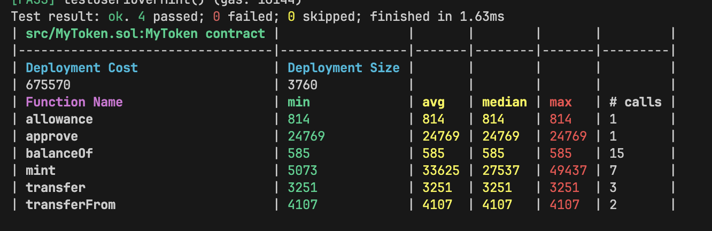

# Web3-Security-Dev-Batch-1-HW
w1

### 完成 mint(address to, uint256 amount) function
[/src/MyTokenTest.sol](./src/MyToken.sol)

### 對應測試
[/test/MyTokenTest.t.sol](./test/MyToken.t.sol)


### 輸出 function Gas


### 部署後合約地址
```bash
forge create --rpc-url=$LOCALHOST --private-key=$PRIVATE_KEY MyToken
```
- contract creation address: 0xbe406ef8d44fb43804489d875519244f5851bf0c [連結](https://sepolia.etherscan.io/address/0xbe406ef8d44fb43804489d875519244f5851bf0c)


##### 尚未完成.. 後面在補上
- [ ] verify smart contract
- [ ] cast test