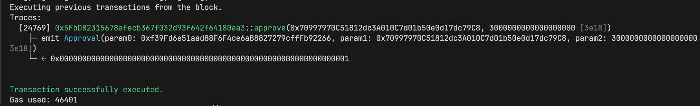

<<<<<<< HEAD
# Web3-Security-Dev-Batch-1-HW
w1

### 完成 mint(address to, uint256 amount) function
[/src/MyTokenTest.sol](./src/MyToken.sol)

### 對應測試
[/test/MyTokenTest.t.sol](./test/MyToken.t.sol)


### 輸出 function Gas


### 部署後合約地址
```bash
forge create --rpc-url=$LOCALHOST --private-key=$PRIVATE_KEY MyToken
```
- contract creation address:  [連結](https://sepolia.etherscan.io/address/0xbe406ef8d44fb43804489d875519244f5851bf0c)

verify smart contract

```bash
forge verify-contract \
    --chain-id 11155111 \
    --watch \
    --etherscan-api-key <your_etherscan_api_key> \
    <the_contract_address> \
    src/MyToken.sol:MyToken
```


### Cast Test
Usage: cast estimate [OPTIONS] [TO] [SIG] [ARGS]... [COMMAND]

- 針對每筆交易都先預估一下 gas usage
- 這邊使用 cast estimate 來預估 mint gas usage
本地
``` bash
cast estimate 0x5fbdb2315678afecb367f032d93f642f64180aa3 "mint(address,uint256)" 0xf39Fd6e51aad88F6F4ce6aB8827279cffFb92266 10
```

``` bash
cast estimate 0xbe406ef8d44fb43804489d875519244f5851bf0c --rpc-url $LOCALHOST "mint(address,uint256)" 0xf39Fd6e51aad88F6F4ce6aB8827279cffFb92266 10
```


- send mint transaction
```bash
cast send 0x5fbdb2315678afecb367f032d93f642f64180aa3 --rpc-url $LOCALHOST --private-key $PRIVATE_KEY "mint(address,uint256)" 0xf39Fd6e51aad88F6F4ce6aB8827279cffFb92266 10

查詢
cast call 0x5fbdb2315678afecb367f032d93f642f64180aa3 --rpc-url $LOCALHOST "balanceOf(address)(uint256)" 0xf39Fd6e51aad88F6F4ce6aB8827279cffFb92266
// result 10

這邊可以發現單位老實講是錯的，因為我們 mint 的時候是 10 wei，但是我們的 token 是 18 decimal，所以我們需要轉換一下
```
- 轉換單位
```bash
cast to-unit xxxxx  [ether, gwei, wei]
cast to-uint256  xxxxx  //轉換成 uint256

```

- 印出結果
```bash
cast tx 0xada66392f2d4f362a05c1ef92c02609339f49f4e90df7c8ab76aceee672177e3
```


```bash
cast send 0x5fbdb2315678afecb367f032d93f642f64180aa3 --rpc-url $LOCALHOST --private-key $PRIVATE_KEY "approve(address,uint256)" 0x70997970C51812dc3A010C7d01b50e0d17dc79C8 3000000000000000000
产生 0xde550530e618bcd89dd8582a5024814b46962c80ad8dada97af443efcb47e2c2 transactionHash

cast run 0xde550530e618bcd89dd8582a5024814b46962c80ad8dada97af443efcb47e2c2
```



```bash
cast send 0x5fbdb2315678afecb367f032d93f642f64180aa3 --rpc-url $LOCALHOST --private-key $PRIVATE_KEY "transferFrom(address,address,uint256)" 0xf39Fd6e51aad88F6F4ce6aB8827279cffFb92266 0x3C44CdDdB6a900fa2b585dd299e03d12FA4293BC 2000000000000000000
```
.env 記得要私鑰的切換


=======
## Foundry

**Foundry is a blazing fast, portable and modular toolkit for Ethereum application development written in Rust.**

Foundry consists of:

-   **Forge**: Ethereum testing framework (like Truffle, Hardhat and DappTools).
-   **Cast**: Swiss army knife for interacting with EVM smart contracts, sending transactions and getting chain data.
-   **Anvil**: Local Ethereum node, akin to Ganache, Hardhat Network.
-   **Chisel**: Fast, utilitarian, and verbose solidity REPL.

## Documentation

https://book.getfoundry.sh/

## Usage

### Build

```shell
$ forge build
```

### Test

```shell
$ forge test
```

### Format

```shell
$ forge fmt
```

### Gas Snapshots

```shell
$ forge snapshot
```

### Anvil

```shell
$ anvil
```

### Deploy

```shell
$ forge script script/Counter.s.sol:CounterScript --rpc-url <your_rpc_url> --private-key <your_private_key>
```

### Cast

```shell
$ cast <subcommand>
```

### Help

```shell
$ forge --help
$ anvil --help
$ cast --help
```
>>>>>>> main
