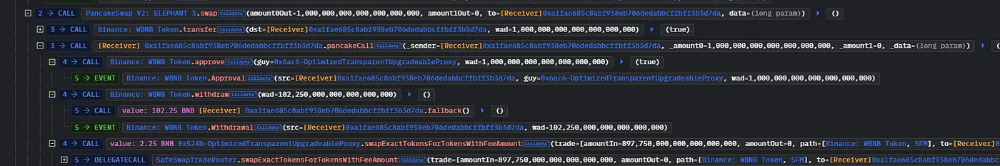

# burn()函數缺乏權限控管，造成約 900 萬美元損失

# Lines of code

https://bscscan.com/address/0xeb11a0a0bef1ac028b8c2d4cd64138dd5938ca7a#code

漏洞位於智能合約程式碼第 1737 行。

# Vulnerability details

SafeMoon Deployer 在合約升級過程中，對 burn()函數進行修改，但修改完後的 burn()函數能見度卻是 public，任何人都可以調用，缺乏權限控管。

```
function burn(address from, uint256 amount) public {
    _tokenTransfer(from, bridgeBurnAddress, amount, 0, false);
}
```

# Impact

burn()函數的功能是將 Token 銷毀移除，在大部分 DeFi 協議中，Token 供應量的多寡會影響其價值；burn()函數設置為 public，代表任何人或攻擊者皆能利用 burn()函數來銷毀 Token，進而操控 Token 的供應量，並控制其市場價值。

# PoC

以下為攻擊者的手法－

準備階段：
攻擊者先大量購買 WBNB Token－大約購買了 102 個－確保後續階段的攻擊有足夠資金。

執行階段：
攻擊者利用 burn()函數缺乏權限控管、任何人可調用的漏洞，大量銷毀 SFM Token，人為提高其價格，再將提高價格的 SFM Token 轉換回 WBNB Token。

提款階段：
攻擊者最後提取約 900 萬美元的 Token，造成 SafeMoon 及其用戶重大損失。

# Recommendation

定期的智能合約審計，特別是合約升級前要預先將升級的程式碼送審。

確保智能合約的函數都做了嚴謹的權限控管。

實施即時監控系統，偵測大量或異常的 Token 交易。

# References

https://www.immunebytes.com/blog/safemoon-exploit-mar-28-2023-detailed-analysis/
https://medium.com/coinmonks/decoding-safemoon-protocols-8-9-million-exploit-quillaudits-a5b11417f0b9
