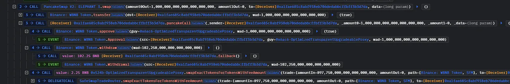
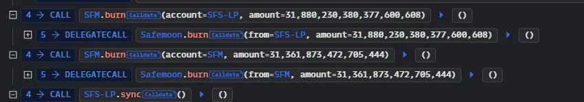

Event:

Someone found an “easy peasy” vulnerability in the Safemoon token pair and made off with almost 9 million dollars.

2023年3月28日，攻擊者利用了Safemoon智能合約burn()函數中的存取控制漏洞。該漏洞是在 SafeMoon Deployer 地址將代幣合約升級到新的實現時引入的。

功能：
Safemoon 協議是建立在幣安智能鏈上的去中心化金融 (DeFi) 平台。
它旨在為用戶提供一個安全可靠的交易和持有加密貨幣的平台。
該平台包括靜態獎勵、自動LP（流動性提供者）獲取和代幣銷毀機制等功能。

https://bscscan.com/address/0xeb11a0a0bef1ac028b8c2d4cd64138dd5938ca7a#code#L1737

錯誤在於
```
    function burn(address from, uint256 amount) public {
        _tokenTransfer(from, bridgeBurnAddress, amount, 0, false);
    }
```
團隊再升級合約的時候造成這個錯誤


攻擊交易
https://bscscan.com/tx/0x48e52a12cb297354a2a1c54cbc897cf3772328e7e71f51c9889bb8c5e533a934

[攻擊交易細節]


攻擊者首先購買大約 102 個 WBNB 代幣，然後將其兌換成 SFM 對對應物。


現在burn()函數已公開，攻擊者隨後銷毀了大量SFM代幣，從而提高了SFM代幣的價格。


最後，攻擊者將 SFM 代幣轉換為 WBNB 代幣，並提取了約 890 萬美元的代幣，給 SafeMoon 用戶造成了巨大損失。


https://medium.com/coinmonks/decoding-safemoon-protocols-8-9-million-exploit-quillaudits-a5b11417f0b9

https://rekt.news/zh/safemoon-rekt/