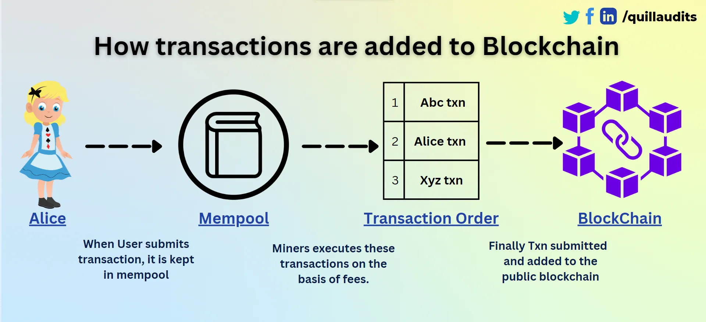
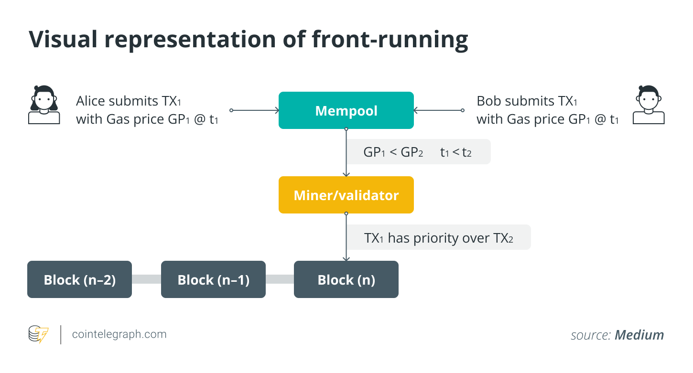

## What is Frontrunning?

### 產生區塊的流程


- Step1: 當用戶向節點提交交易時，它不會立即添加到區塊中。在驗證交易之前，這些未開採的交易被保存在一個稱為 Mempool 的等待室中。

- Step2:
  礦工將有效交易添加到區塊中，但不能保證它們將以與發送時相同的方式排序。這些礦工根據Gas fee 執行交易。


### Front Running

Front-running（搶先交易）是一個股票市場術語，指的是利用有關即將發生的交易的內幕信息，在競爭之前進入市場。因此，這是一種內線交易。

而再 web3 如果如果礦工(或其他人)注意到特定加密貨幣代幣的大額購買訂單，他們可能會先插入自己的購買訂單，然後驗證更大的購買訂單，然後進行套利。

EX:



案例：

Catgirl 貓女

Catgirl 是一個 NFT 市場，允許用戶列出、購買、出售和取消訂單。


以下的功能允許用戶透過 BNB 代幣交換他們的 Catgirl NFT，但由於交換操作期間缺乏最低輸出值執行機制，目前存在潛在的搶先交易風險。

當發生非常大的掉期交易時，惡意用戶可能會以更高的汽油費介入以搶佔交易，導致買方以更高的價格購買


```
 function swapBNBForCatgirl(uint256 amount) private {
        address[] memory path = new address[](2);
        path[0] = pancakeRouter.WETH();
        path[1] = address(uCatgirlToken);
        pancakeRouter.swapExactETHForTokensSupportingFeeOnTransferTokens{
            value: amount
        }(0, path, address(this), block.timestamp);
    }
```