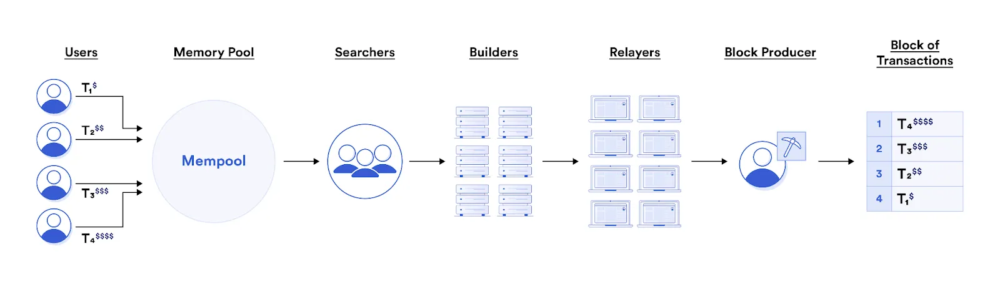

## What is mev bot
### What is MEV
Maximal Extractable Value (MEV)，即最大可提取價值，是驗證者或礦工可以從區塊鏈上的區塊生產中提取的最大價值。
- 如何產生區塊？

  在區塊鏈上，交易被捆綁為稱為區塊的捆綁包，並發送給驗證者或礦工，驗證者批准交易以換取「區塊獎勵」。一旦獲得批准，該區塊就成為區塊鏈的一部分。這一系列事件構成了區塊生產。

- 「區塊獎勵」

  由於礦工和驗證者可以`完全控制交易排序`，因此他們有獨特的機會透過策略形成和交易排序來獲取額外利潤

### 常見結果

常見透過 MEV策略 結果：套利、利用搶先交易、閃電貸款等進行夾心交易。

### MEV on Ethereum 
雖然 MEV 與所有區塊鏈相關，但我們通常在以太坊的背景下討論它

### MEV bot

MEV 機器人是一種軟體應用程序(複雜的演算法策略)。用於追蹤區塊鏈的新交易、識別盈利機會並代表其所有者執行這些交易。而使用者可以通過支付額外的手續費來提高自己被發現的機會。

### How does MEV bot work

- 第一階段：搜尋者觀察交易

  以太坊上的交易永遠不會立即執行。它們排隊等待被選擇並作為區塊的一部分發送以供批准。它們透過網路上的公共節點進行路由，使用 MEV 機器人的搜尋者觀察 memoryPool 中的交易，以識別有利可圖的交易。

- 第二階段：模擬交易進行測試

  檢驗 MEV 策略是否能產生價值。為此，"搜尋者"在其私人節點上模擬交易。

- 第三階段：捆綁並發送交易

  如果模擬顯示有利可圖的結果。 MEV 機器人可以開始將其交易與從公共記憶體池中選擇的交易捆綁在一起，然後將捆綁的交易轉送到驗證器節點以供批准。
  

- 第四階段：驗證者節點提出新區塊

  驗證者向以太坊網路提議一個新區塊➡提議的區塊被添加到網路中。因此，帶有機器人的搜尋者賺取利潤，而驗證者則以汽油費的形式獲得部分利潤。

### MEV bot 的優點

- MEV 不僅限於礦工，擴大了以太坊用戶利用鏈上獲利機會的範圍。

- 使用者友善的工具允許不懂技術的參與者匯集流動性並從利潤中獲利。

- 以套利為中心的 MEV 機器人透過糾正去中心化交易所 (DEX) 之間的價格差異來提高市場效率。

### MEV bot 的缺點

- 有可能損害區塊鏈的透明度和公平性，有利於那些擁有更多資源和影響力的人。

- 可能會帶來不可預測的市場波動，讓交易者措手不及並觸發停損。

- 用於欺騙活動的有吸引力的工具，使惡意行為者能夠利用智慧合約漏洞。

- 涉及的固有風險；不成功的策略可能會導致財務損失。

## Reference
https://www.tastycrypto.com/defi/mev-bots/