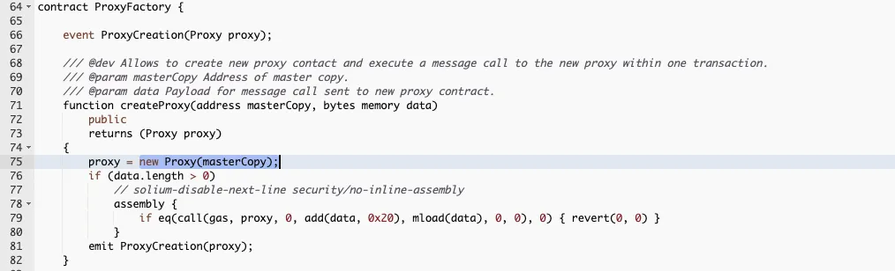

# Proxy Factory 合約未遵守 EIP-155，使攻擊者能結合 CREATE 進行 Replay Attack

# 事件概述

Wintermute 是一家加密貨幣市場製造商，受到 Optimism 基金會委託，為 OP Token 在中心化交易所上市時提供流動性。

在準備過程中，Optimism 發送 2000 萬美元的 OP Token 給 Wintermute，但 Wintermute 發現他們無法存取這些 Token，因為他們提供的地址是以太坊 (L1) 多簽錢包地址，而該地址尚未部署到 Optimism (L2) 。

攻擊者發現了這一點，並在 Wintermute 之前將與 L1 相同地址的多簽錢包地址部署到 L2，因此獲得 2000 萬美元的 OP Token。

# 事件起源

Optimism 轉帳 20 million $OP 給 Wintermute：

由於 Wintermute 提供的錢包地址是一個以太坊（L1）的多簽錢包地址，但沒有相應在 Optimism（L2）上部署，因此當 Optimism（L2）嘗試轉賬給該錢包地址時，它實際上轉給了一個在 L2 上尚未被任何人控制的錢包地址，我們姑且將該地址稱之為 B 錢包地址（L2）。

# 事件漏洞

Wintermute 的以太坊（L1）多簽錢包地址：

Wintermute 在以太坊（L1）的多簽錢包地址，是由 Gnosis Safe Deployer 部署的 Gnosis Safe Proxy Factory 合約生產的，這個合約調用 createProxy()函數來使用 new 關鍵字，new 關鍵字則是使用 CREATE 作為 opcode（操作碼），CREATE opcode 則利用 sender 的地址及 nonce 計算出新的錢包地址。而因為每次生產錢包時 nonce 的值都會增加，所以每個生產出來的錢包地址都是獨一無二的。

# 利用漏洞

結合上述事件起源與事件漏洞，理論上要生產出 B 錢包地址（L2），需要滿足以下條件：

1. sender 的地址必須等同 Gnosis Safe Proxy Factory 合約地址

2. nonce 的值相同

解決第一個問題－sender 的地址：

由於 Gnosis Safe Proxy Factory 合約地址是在 L1，且未遵守 EIP-155（缺少鏈 ID）；因此攻擊者能使用 Etherscan 查詢 Gnosis Safe Proxy Factory 合約地址的部署細節，例如 nonce, gasprice, startgas, to, value, data 的值，接著利用這些值在 Optimism（L2）上重新發送，即能在 Optimism（L2）上重播 Ethereum（L1）的部署，成功在 Optimism（L2）上部署一個與 Ethereum（L1）地址相同的 Gnosis Safe Proxy Factory 合約。

解決第二個問題－nonce 的值：

部署 Gnosis Safe Proxy Factory 合約到 Optimism（L2）上後，攻擊者可藉由不斷使用 createProxy()函數增加 nonce 的值，並比對使用該 nonce 值生產出的錢包地址是否等於 B 錢包地址（L2）；比對成功後，攻擊者即取得 B 錢包地址（L2）的控制權。

# References

https://inspexco.medium.com/how-20-million-op-was-stolen-from-the-multisig-wallet-not-yet-owned-by-wintermute-3f6c75db740a
https://www-coindesk-com.translate.goog/tech/2022/06/09/15m-of-optimism-tokens-stolen-by-an-attacker-after-wintermute-sent-wrong-wallet-address/
