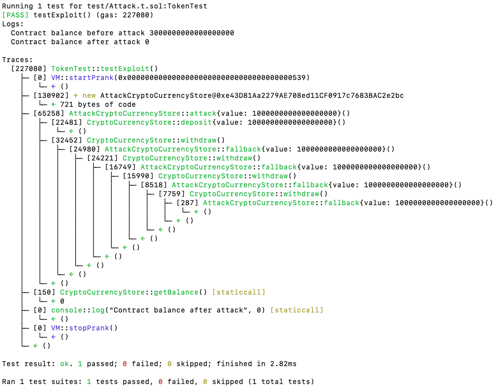
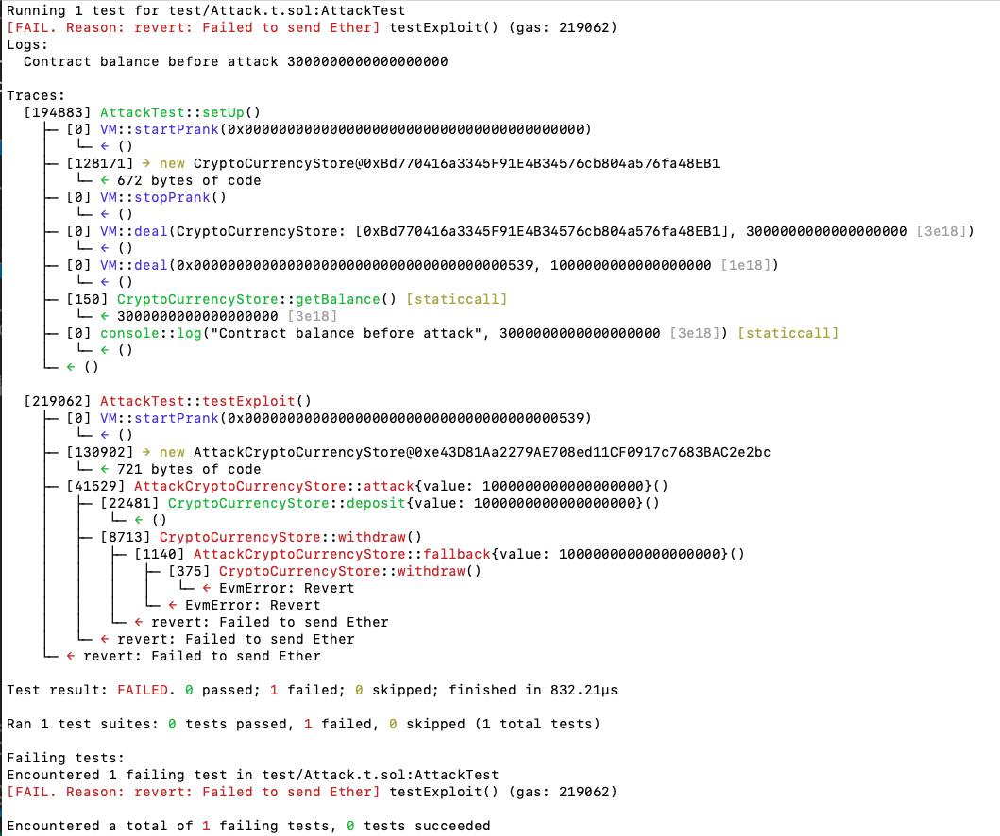
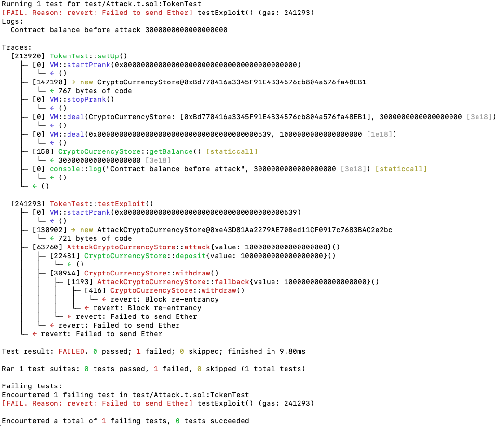

# Homework 5

### Summary

CryptoCurrencyStore is a simple crypto currency store like a bank. That is a protocol for Reentrancy Attack practice. I use two analyzer tools, slither and 4naly3er to produce the reports by myself.

### Lines of code

CryptoCurrencyStore.sol#L22-L27

### Vulnerability Detail

The withdraw() function that is used to withdraw ethers from user balances mapping variable contains a critical bug. It calls "msg.sender.call" that will trigger the fallback function which attacker could utilize it to take back all of the ethers of contracts.

```solidity
  function withdraw() public {
    uint256 userBalance = balances[msg.sender];
    require(userBalance > 0);

    (bool sent,) = msg.sender.call{value: userBalance}("");
    require(sent, "Failed to send Ether");

    balances[msg.sender] = 0;
  }
```

### Impact

The balance of contract will exhaust by attacker fallback contract if attacker balance is enough for gas consumption.

### Proof of Concept

1. CryptoCurrencyStore has 3 ethers.
2. Hacker deposits 1 ether.
3. Hacker withdraws 1 ether.
4. Contract triggers fallback function by msg.sender.call{value: userBalance}("");
5. After withdrawal, the balance of contract exhausted.

   

### Tools Used

Foundry, Slither(slither_report.md), 4naly3er(4naly3er_report.md)

### Recommended Mitigation Steps

1. add mutex to revert illegal reentrant

```solidity
  modifier nonReentrant() {
    require(!lockedState, "Block re-entrancy");
    lockedState = true;
    _;
    lockedState = false;
  }

  function withdraw() public nonReentrant {
    ... skip
  }
```



2. adjust the statement order under withdraw() function

```solidity
    uint256 userBalance = balances[msg.sender];
    balances[msg.sender] = 0;
    require(userBalance > 0);

    (bool sent,) = msg.sender.call{value: userBalance}("");
    require(sent, "Failed to send Ether");
```



### Reference

- Slither analyzer tools [slither_report](./slither_report.md)
- 4naly3er analyzer tools [4naly3er_report](./4naly3er_report.md)
