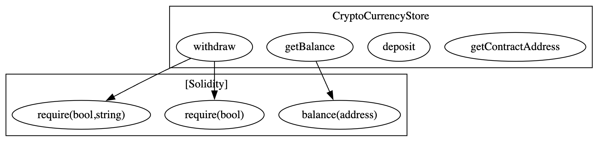

## Slither Analysis Report

### $ slither src/CryptoCurrencyStore.sol

'forge config --json' running
Installing solc '0.8.18'...
Version '0.8.18' installed.
'/Users/walter/.solc-select/artifacts/solc-0.8.18/solc-0.8.18 --version' running
'/Users/walter/.solc-select/artifacts/solc-0.8.18/solc-0.8.18 @openzeppelin/contracts/=lib/openzeppelin-contracts/contracts/ ds-test/=lib/forge-std/lib/ds-test/src/ erc4626-tests/=lib/openzeppelin-contracts/lib/erc4626-tests/ forge-std/=lib/forge-std/src/ openzeppelin-contracts/=lib/openzeppelin-contracts/ solmate/=lib/solmate/src/ src/CryptoCurrencyStore.sol --combined-json abi,ast,bin,bin-runtime,srcmap,srcmap-runtime,userdoc,devdoc,hashes --optimize --optimize-runs 200 --evm-version paris --allow-paths .,/Users/walter/Desktop/Foundry/ERC20Test/src' running

```
INFO:Detectors:
Reentrancy in CryptoCurrencyStore.withdraw() (src/CryptoCurrencyStore.sol#20-28):
    External calls:
        - (sent) = msg.sender.call{value: userBalance}() (src/CryptoCurrencyStore.sol#24)
    State variables written after the call(s):
        - balances[msg.sender] = 0 (src/CryptoCurrencyStore.sol#27)
    CryptoCurrencyStore.balances (src/CryptoCurrencyStore.sol#5) can be used in cross function reentrancies:
        - CryptoCurrencyStore.balances (src/CryptoCurrencyStore.sol#5)
        - CryptoCurrencyStore.deposit() (src/CryptoCurrencyStore.sol#16-18)
        - CryptoCurrencyStore.withdraw() (src/CryptoCurrencyStore.sol#20-28)
```

Reference: https://github.com/crytic/slither/wiki/Detector-Documentation#reentrancy-vulnerabilities

```
INFO:Detectors:
    Low level call in CryptoCurrencyStore.withdraw() (src/CryptoCurrencyStore.sol#20-28):
        - (sent) = msg.sender.call{value: userBalance}() (src/CryptoCurrencyStore.sol#24)
```

Reference: https://github.com/crytic/slither/wiki/Detector-Documentation#low-level-calls

INFO:Slither:src/CryptoCurrencyStore.sol analyzed (1 contracts with 94 detectors), 2 result(s) found

### $ slither src/CryptoCurrencyStore.sol --print human-summary

```
INFO:Printers:
Compiled with solc
Total number of contracts in source files: 1
Source lines of code (SLOC) in source files: 27
Number of  assembly lines: 0
Number of optimization issues: 0
Number of informational issues: 1
Number of low issues: 0
Number of medium issues: 0
Number of high issues: 1

+---------------------+-------------+------+------------+--------------+-------------+
| Name                | # functions | ERCS | ERC20 info | Complex code |    Features |
+---------------------+-------------+------+------------+--------------+-------------+
| CryptoCurrencyStore |           4 |      |            |           No | Receive ETH |
|                     |             |      |            |              |    Send ETH |
+---------------------+-------------+------+------------+--------------+-------------+
INFO:Slither:src/CryptoCurrencyStore.sol analyzed (1 contracts)
```

### $ slither src/CryptoCurrencyStore.sol --print call-graph

產出合約的 function graph 

### $ slither src/CryptoCurrencyStore.sol --print contract-summary

```
INFO:Printers:
+ Contract CryptoCurrencyStore (Most derived contract)
  - From CryptoCurrencyStore
    - deposit() (public)
    - getBalance() (public)
    - getContractAddress() (public)
    - withdraw() (public)

INFO:Slither:src/CryptoCurrencyStore.sol analyzed (1 contracts)
```

### $ slither src/CryptoCurrencyStore.sol --print data-dependency

```
INFO:Printers:
Contract CryptoCurrencyStore
+-------------+---------------------------+
| Variable    |              Dependencies |
+-------------+---------------------------+
| balances    | ['balances', 'msg.value'] |
| lockedState |           ['lockedState'] |
+-------------+---------------------------+

Function deposit()
+---------------------------------+---------------------------+
| Variable                        |              Dependencies |
+---------------------------------+---------------------------+
| CryptoCurrencyStore.balances    | ['balances', 'msg.value'] |
| CryptoCurrencyStore.lockedState |                        [] |
+---------------------------------+---------------------------+
Function withdraw()
+---------------------------------+------------------------------------------------------+
| Variable                        |                                         Dependencies |
+---------------------------------+------------------------------------------------------+
| userBalance                     |                                         ['balances'] |
| sent                            | ['TUPLE_0', 'balances', 'msg.sender', 'userBalance'] |
| CryptoCurrencyStore.balances    |                                         ['balances'] |
| CryptoCurrencyStore.lockedState |                                                   [] |
+---------------------------------+------------------------------------------------------+
Function getBalance()
+---------------------------------+--------------+
| Variable                        | Dependencies |
+---------------------------------+--------------+
|                                 |           [] |
| CryptoCurrencyStore.balances    |           [] |
| CryptoCurrencyStore.lockedState |           [] |
+---------------------------------+--------------+
Function getContractAddress()
+---------------------------------+--------------+
| Variable                        | Dependencies |
+---------------------------------+--------------+
|                                 |           [] |
| CryptoCurrencyStore.balances    |           [] |
| CryptoCurrencyStore.lockedState |           [] |
+---------------------------------+--------------+
Function nonReentrant()
+---------------------------------+-----------------+
| Variable                        |    Dependencies |
+---------------------------------+-----------------+
| CryptoCurrencyStore.balances    |              [] |
| CryptoCurrencyStore.lockedState | ['lockedState'] |
+---------------------------------+-----------------+
INFO:Slither:src/CryptoCurrencyStore.sol analyzed (1 contracts)
```

### $ slither src/CryptoCurrencyStore.sol --print function-summary

```
INFO:Printers:
Contract CryptoCurrencyStore
Contract vars: ['balances', 'lockedState']
Inheritance:: []

+----------------------+------------+-----------+----------------------------+--------------+-------------------------------------------+-------------------------------------------+-----------------------+
| Function             | Visibility | Modifiers |                       Read |        Write |                            Internal Calls |                            External Calls | Cyclomatic Complexity |
+----------------------+------------+-----------+----------------------------+--------------+-------------------------------------------+-------------------------------------------+-----------------------+
| deposit()            |     public |        [] | ['balances', 'msg.sender'] | ['balances'] |                                        [] |                                        [] |                     1 |
|                      |            |           |              ['msg.value'] |              |                                           |                                           |                       |
| withdraw()           |     public |        [] | ['balances', 'msg.sender'] | ['balances'] | ['require(bool)', 'require(bool,string)'] | ['msg.sender.call{value: userBalance}()'] |                     1 |
| getBalance()         |     public |        [] |                   ['this'] |           [] |                      ['balance(address)'] |                                        [] |                     1 |
| getContractAddress() |     public |        [] |                   ['this'] |           [] |                                        [] |                                        [] |                     1 |
+----------------------+------------+-----------+----------------------------+--------------+-------------------------------------------+-------------------------------------------+-----------------------+

+----------------+------------+-----------------+-----------------+--------------------------+----------------+-----------------------+
| Modifiers      | Visibility |            Read |           Write |           Internal Calls | External Calls | Cyclomatic Complexity |
+----------------+------------+-----------------+-----------------+--------------------------+----------------+-----------------------+
| nonReentrant() |   internal | ['lockedState'] | ['lockedState'] | ['require(bool,string)'] |             [] |                     1 |
+----------------+------------+-----------------+-----------------+--------------------------+----------------+-----------------------+

INFO:Slither:src/CryptoCurrencyStore.sol analyzed (1 contracts)
```
