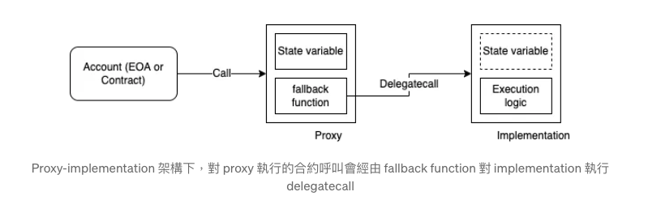
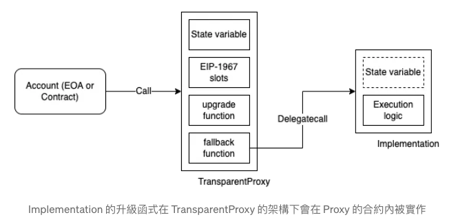
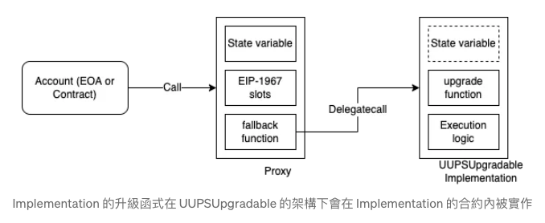
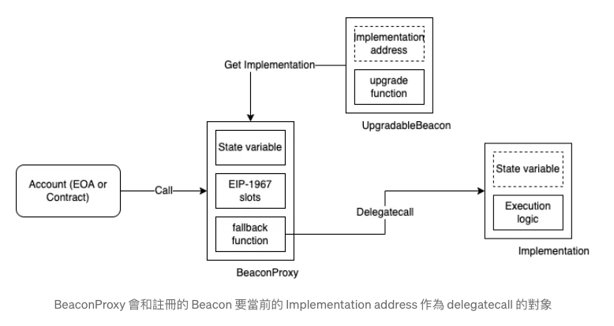
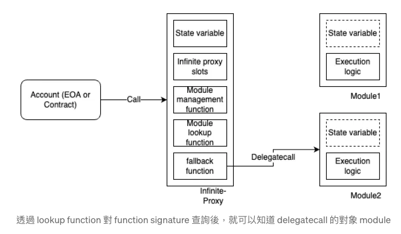

## Group 2 Home Work

### 了解何謂代理合約?

- 開發鏈上合約時，由於區塊鏈的特性，合約部署後往往無法再更動代理合約，但若是原合約有嚴重的問題，又未設計廢棄或緊急停止的功能，就沒有補救手段了
- proxy-implementation 的架構，就是這樣的限制下，保有一定彈性的一種作法
- 將合約記錄狀態(state variable)及運算邏輯(功能)分離開來，就可以在不更動執行單位的前提下，透過更動「運算邏輯(功能)」去修補或是擴充原有合約的功能，且同時取用「合約記錄狀態」，避免 migrate state variable 到新的合約的必要
- 要達到這樣的效果，delegatecall 是最關鍵且方便取用的作法
- 將部份 state variable 和運算邏輯定義於原合約作為 caller，另一部份的邏輯實作於 delegate 對象合約作為 callee
- 在作為 caller 的原合約完全不定義 state variable，並透過將 delegatecall 實作於 fallback function 中，讓執行的 function 包含 function name 都完全透過 delegate 對象合約的 callee 來定義
  
- 改變合約的運算邏輯而不改變其地址

### 常見的幾種代理合約架構

- EIP-1967 Standard proxy storage slots 提出了一系列的 storage slot 來記錄 proxy 需要的資訊，例如紀錄 implementation 合約的地址等等\
- 並依據以上的 storage slot 實作了下面不同的功能
- Transparent vs UUPS proxy

  - Transparent 的設計（可參考 TransparentProxy.sol）是把升級的 function 直接定義於 proxy 合約中，並由定義在 \_ADMIN_SLOT 的 administrator 來執行這個動作
    
  - UUPS（可參考 UUPSUpgradable.sol）則不在 proxy 中定義升級的邏輯，而是在執行邏輯的合約中定義。如此的好處是 proxy 本身可以變得更輕量化，但相對的 implementation 就會需要包含這段邏輯
    

- Beacon
  - Beacon（可參考 BeaconProxy.sol）用於同時管理大量的 proxy，讓這些 proxy 可以指到同一個 implementation
  - 僅部署了一份 implementation，讓複數的 proxy 去基於同樣的邏輯，但擁有各自的參數去提供各自的功能，此時若要更新所有 proxy 的行為，一種做法是讓所有 proxy 的 administrator 各自去處理，另一種就是讓這些 proxy 的 implementation 參考到 beacon 合約上的值，如此一來就可以透過更新 beacon 合約的內容去執行 implementation 合約
    
- Infinite-proxy
  - 當只有部分的邏輯需要被更動時，整份的 implementation 都需要被重新部署，其中也包含了那些不需要被更動的部分。或者是當 implementation 包含了太大量的邏輯，導致合約本身過大時，受限於 contract size limit，合約會無法被部署
  - 在對 proxy 做呼叫時，calldata 內會包含 function signature 以及呼叫用的 parameter，若能透過 function signature 多做一層查表，讓不同的 function call 分別對應到不同的 implementation，就可以讓 proxy 在不影響使用者操作的狀況下，同時對應到不同的 implementation，進而減小單一合約的大小，也降低當升級時，對處理不需升級的那些邏輯不必要的操作，這些 implementation 被稱為 module
    
- EIP-2535 Diamond proxy
  - infinite-proxy 的進階版

### 常見的幾種代理合約的漏洞樣態

- 未初始化的代理合約

  - 代理沒有 constructor，它們通常具有用於設定關鍵參數的 initialize() 函數
  - 初始化應該是一次性操作，類似於建構函式。然而，可能會發生這種情況，由於某種原因，函數 initialize()沒有被調用，並且合約部署在區塊鏈上，並且任何人都可以調用 initialize()函數，這意味著任何攻擊者都可以呼叫該函數並接管存在漏洞的合約
  - 利用情境通常可能涉及將合約實作更新為攻擊者控制的合約實現，其中包含執行 selfdestruct 的惡意函數。如果代理程式使用 delegatecall，一旦呼叫 selfdestruct，就會對存在漏洞的合約的儲存執行銷毀操作

- 多次初始化

  - 若 initialize() 無法標記初始化已完成，這意味著可以多次完成初始化，在這種情況下，攻擊者可以隨時呼叫 initialize()來接管合約

- 搶先交易初始化
  - 在初始化可升級合約時，仍然有可能獲得搶先機會。由於初始化通常是公共函數，即使是一次性的，也應該在部署後檢查交易是否從正確的帳戶成功以及是否不是搶先交易
  - 只需在部署後檢查合約是否擁有者是誰應該是確保不發生搶先交易的最快、最有效的方法

### 參考

- Proxy contract 設計與變形: https://medium.com/taipei-ethereum-meetup/proxy-contract-variations-6f9d359d35bf
